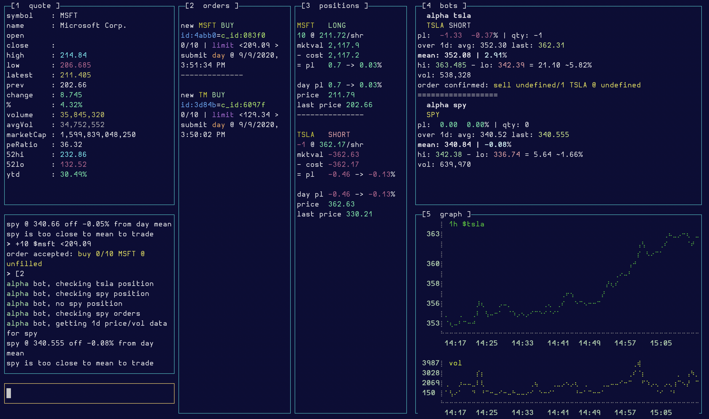

# bots

## introduction

Bots in iexcli are async nodejs functions that accept a few workspace related
params and optionally return an interval that can be started and stopped from
the command line in iexcli. All functions must be exported from the file found
at the root level of this repository named `bots.js`. See demo bot at
[docs/bots/alpha.js](docs/bots/alpha.js). The parameters passed down to the
bot on instantiation include two printing functions that are the primary ways
your bot communicates with the interface.


> The above image was generated using the config found at
[docs/example-configs/alpaca.json](docs/example-configs/alpaca.json) 

In the above image, there is a bots component in the upper-right hand corner of
the screen. The bots are also able to dump text to the repl output.

Also see [alpaca config](docs/example-configs/alpaca.json) for a sample trading
work station.

Currently all bots' runtimes will be constrained by iexcli's, which means that
bots started through the iexcli app will not continue running if iexcli shuts
down for any reason. So it is not recommended to use longer term bots with
iexcli at the moment, but rather only ones that can be started and stopped
without too much overhead.

For instance, if a bot calls up GBs of data to analyze before it starts
trading and is expected to run for days, this would not be a great tool to
manage that, as it is still too unstable. Rather this might be a good way to
quickly develop algorithms against live market data, and have a strong visual
indication of what different bots are doing under different market situations.

## usage

Export your functions from `bots.js` in the top-level directory of this repo.

If you have exported your functions correctly, they should be listed when you
type `bots ls` in the repl. Type `bots start {yourbotname}`, as displayed in
the `bots ls` command, to start your bot. Type `bots stop {yourbotname}` to
halt the bot.

## running a real trading algo

If you are using paper keys or are comfortable with this bot trading with your
money, try typing `bots` and then `bots ls` to list bots and then, *if you are
ok with the bot trading on your alpaca account* type `bots start alpha $spy`
in the repl. The first command displays the bots component. The second lists
the available bots and the third starts [alpha bot](alpha.js) which is based
on a mean-reversion algorithm, targeting `$SPY`. 

[alpha bot](alpha.js) contains many comments and serves as documentation for
building algo bots in iexcli. You'll see that the bot can print to the repl
output window and to the bot component, which offers some default text
formatting, as well as a place to dump more persistent messages.

## developer info

Bot functions are supplied two parameters: `ws` and `options`. There is a
`print(botInfo)` method on the options object you can use to update the bots
component if one is available. You can also use `ws.printLines(lines)` to
print to the repl output.

`ws`, workspace, should be treated as read-only. Its `printLines()` method
accepts either an array of strings or a string, single line or multi-line is
fine. The function prints to the repl output if one is available.

The options object has the following shape, and should be treated as
read-only:

```javascript
const options = {
  symbol: 'symbol value',
  time: 'parsed time value',
  print: print(botInfo),
}
```
ex
```javascript
async function meanRev(ws, options){
  const interval = setInterval(()=>{
  // 1) get data
  // 2) make a trading decision
  // 3) make trade
  // 4) print message
  options.print({
    bot: 'meanRev',
    symbol: options.symbol,
    pl: 123,
    plpc: 4.3,
    qty: 100,
    msg: `the message you wish to be displayed below the bots\' listing.
Use {red-fg}ansi{/} {#00f-fg}escape codes{/} to color your own output`
  })
  // sleep for 1000 ms and run this again
  }, 1000)

  // return the interval to allow iexcli to start and clear it from the repl
  return interval
}
```

`options.print(botInfo)` is a special printer for the `bots` component. It takes
one parameter, `botInfo`, that has the following shape:

```javascript
const botInfo ={
  bot: '(string) the name of the bot. Must match the function name!',
  symbol: '(string) the stock your bot is trading',
  pl: '(number) profit/loss',
  plpc: '(number) percent profit/loss',
  // percent DEPRECATED use plpc instead
  qty: '(number) size of position',
  msg: `(string) the message you wish to be displayed
  below the bots\' listing`
}
```

The function will format this in a convenient way for the bot component and
print it there with along with all the other bot info.

Feel free to import any functions that might be of use such as `qFetch()` which
will discard old messages (useful if you are polling frequently and want only
the latest message), and `buildPriceVolCharts()`. There are few comments and
while they are under active development the documentation is a TODO. Their
param and return signatures are liable to change!

## running the bots

From the command line, type `bots ls` to view your available bots. To start a
bot, type `bots start {yourbotname}`. To stop one, type `bots stop
{yourbotname}`. You can change the active symbol on the options passed down,
by adding a `$symbol` to the command.

If you start a bot twice, the first bot will be stopped before the bot is
started again with new params. Currently the only way to run a function on
multiple stocks is to follow the practice shown in [bots.js](../../bots.js),
which is to export the same function twice, under different names.

## development

- A fix for function naming.

- Work is in development on a socket based interface to allow independent bot
  runtimes that can be monitored from the iexcli interface.


